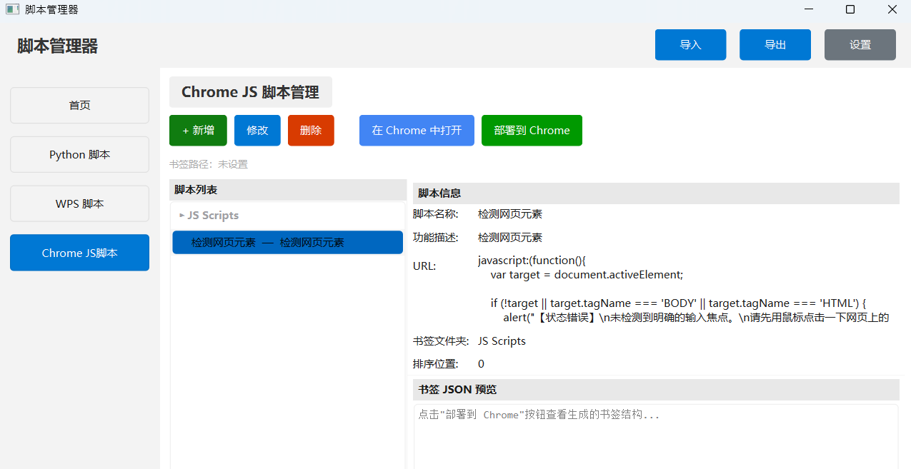
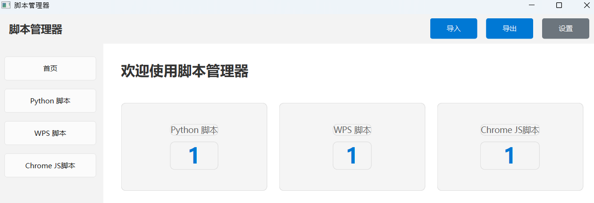
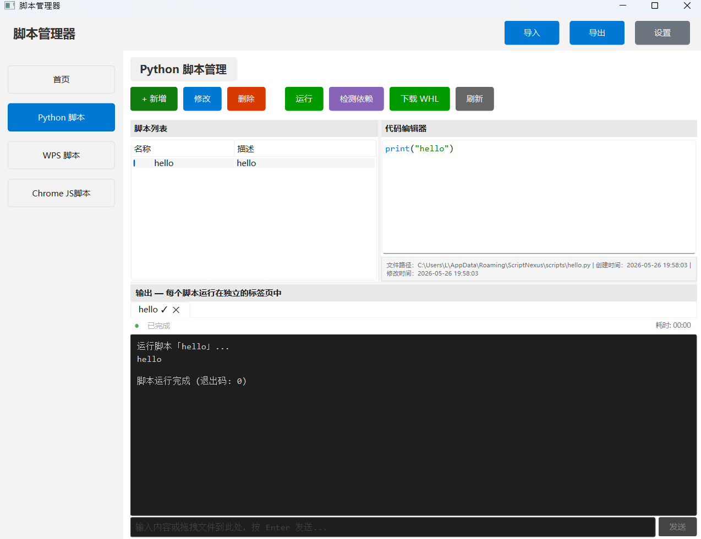
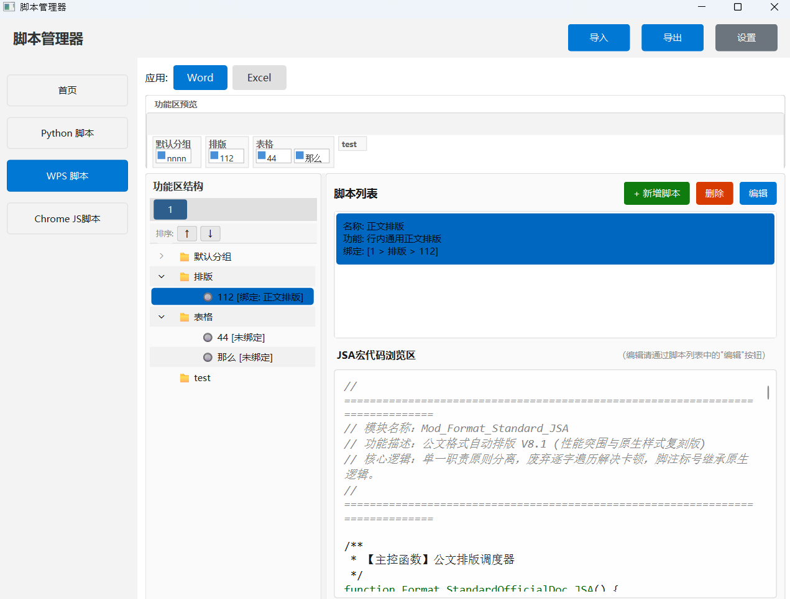
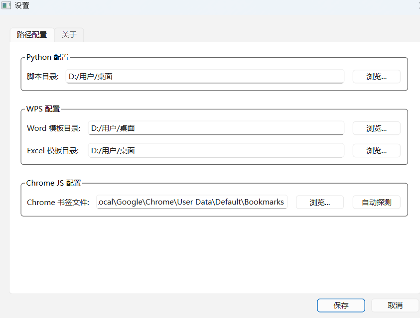

# ScriptNexus — Office Script Management Platform 🚀

[](LICENSE)
[]()
[]()

> An AI-assisted office automation tool built from scratch with vibe coding, designed for enterprise intranet environments.

[简体中文](README.md) | English

---

## 📖 About This Project

I'm an employee with **no formal technical background**.

Riding the wave of rapid AI advancement, I started learning vibe coding to solve real problems in my daily office work. ScriptNexus is the **first complex project** I've completed on this journey — it grew organically from enterprise office needs into a unified platform for managing Python scripts, WPS macros, and Chrome JS bookmarklets.

Tested and proven effective in a real office environment, it genuinely improves daily productivity. My goal is for this project to serve as a **foundation for an office-automation ecosystem**, lowering the barrier for people to leverage AI in their workflows.

> ⚠️ Currently Windows-only. Linux (Kylin OS) support is planned.

---

## 📸 Screenshots







---

## 🎯 Features

| Module | Description |
|--------|-------------|
| **Python Module** | Write, edit, run Python scripts with real-time I/O, multi-process execution, dependency checking, and WHL download |
| **WPS Module** | Manage WPS Office macros with visual Ribbon UI editor and one-click Word/Excel template deployment |
| **Chrome JS Module** | Manage JavaScript bookmarklets with Chrome bookmarks integration |
| **Import/Export** | Package scripts and configs as `.snx` files for easy migration across workstations |
| **System Tray** | Minimize to tray with right-click quick-access menu |

---

## 📦 System Requirements

- Windows 10+
- WPS Office (for WPS module)
- Google Chrome (for JS module)
- Python 3.10+ (when running from source)

---

## 🚀 Quick Start

### From Source

```bash
git clone https://github.com/YOUR_USERNAME/ScriptNexus.git
cd ScriptNexus
pip install -r requirements.txt
python app.py
```

### From Executable

Download the latest `ScriptNexus.exe` from [Releases](https://github.com/YOUR_USERNAME/ScriptNexus/releases).

---

## 📥 Build

```bash
build_windows.bat
```

Output: `dist/ScriptNexus.exe`.

---

## 💻 Development

```bash
pip install -r requirements.txt
python app.py

# Run tests
pytest tests/
```

---

## 🤔 FAQ

> **Q: Why Windows only?**

A: The primary office environment runs Windows. Linux (Kylin OS) support is planned.

> **Q: What WPS version is required?**

A: A recent version of WPS Office is recommended. The WPS module depends on the add-in mechanism and customUI ribbon configuration.

> **Q: How to install dependencies in an offline environment?**

A: The Python module includes an offline WHL download feature — download packages on an internet-connected machine and transfer them via USB.

---

## 📝 License

MIT License — see [LICENSE](LICENSE).
